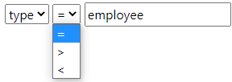

# Alfred Object Queries


[](https://coveralls.io/github/lmeysel/alfred-object-queries)
[](https://paypal.me/lmeysel)
## Why "Alfred"?
Why not?

## Why another library?

When creating dashboards I often face the situation, that displayed data needs to be filtered. Many interfaces solve this problem by providing a property-comparator-value pattern, like `age < 60` or `type = "employee"`. Then you see something like this:



Maybe the users are allowed to add multiple of these rows to filter more properties. And that is where the hassle begins: How are multiple conditions are conjugated? Should it be `Condition1 AND Condition2` or better `Condition1 OR Condition2`?  Okay, let the user decide: Add another select to each row, to let the user choose between `and` and `or`. Cool. The interface looks terrible and becomes clumsy and probably unresponsive. When the data becomes more complex, the demand for filtering also may become more complex: Think of a car-dealer, who looks for VWs which ran less then 50k miles or are blue? This query would look like `brand: VW and (color: blue or miles < 50k)`. Simple query, but the UI now would become pretty complex (consider the unneglectible paretheses). Futhermore to set up this filter many clicks are necessary. Why can I not easily _type_ what I want?

This is why I finally decided to create another library (to be honest I was surprised not to find a ready-to-go solution for this, as e.g. github search works like this). By keeping the syntax as simple as possible the user must neither be an excel-pro nor programmer to understand what he types.

## Quick start

You know all that ... download/install:

```
npm i alfred-object-queries
```

Import module:
```typescript
import { QueryManager } from 'alfred-object-queries';
```

And run your first query:

```typescript
const parser = QueryManager.create();

declare const cars: Array<ICar>;

const VWs = cars.filter(parser.matcher('brand: VW'));
```

Thats it! Booooooring. Fortunately there is more.

## Query syntax

Okay, let's declare few terms: 

* **Query** is the whole expression, e.g. `brand: VW and miles < 50000`
* **Condition** then are these `brand: VW`, `miles < 50000`
* and a condition is build of **property**, **comparator** and **value**.
* And conditions are connected by **conjugations**, as of now `and` and `or`.

The following comparators can be used:
* equals `:`
* greater than `>` and greater or equal than `>=`
* less than `<` and less or equal than `<=`

Properties can be addressed as simple word or if special chars are needed also with single or double quotes: `"brand": VW` or `'brand': VW`.

Values can be specified as word
* Word: `brand: VW`
* String: `brand: "VW"` or `brand: 'VW'`
* Regular expression, as long as no [Casting](#Casting) is specified for the property: `brand: /^VW$/`. RegEx flags (`/VW/mgi`) __are not supported__!

Queries can be nested: `brand: VW and (color: blue or miles < 50000)`. `and`-conjugations take precedence over `or` conjugations. This means `miles < 50000 or brand: VW and color: blue` is actually evaluated as `miles < 50000 or (brand: VW and color: blue)`.

As the main goal is to make this queries accessible by "normal" users, it should be simple and failure-tolerant. For many use-cases it might be suitable just to query two or three properties expecting them all fulfilled. E.g. when searching for GitHub issues you maybe know this: `is:issue issues:open`. This actually is `is:issue AND issue:open`. While I don't know, whether you could also use `OR` at GitHub, with this library you can - but it also supports "implicit conjugations", i.e. `brand: VW and miles < 50000` is the same as `brand: VW miles < 50000`. If you prefer implicit `OR` instead of default implicit `AND`, you can configure it using the `defaultConjugation`-setting, explained in the following section.

## General configuration

As second, optional argument, the QueryParser takes an options object:
```typescript
declare const query: string
declare const settings: ParserSettings;
const manager = QueryManager.create(settings)

manager.parse(query);
```

With the settings object you may configure the following:

| setting | type | default | description |
|---|---|---|---| 
| `whitelist` | `string[]` | `null` | Explicitly define queryable properties. |
| `blacklist` | `string[]` | `null` | Explicitly define non-queryable properties. |
| `defaultConjugation` | `'and' \| 'or'` | `'and'` | Use this as implicit conjugation when no conjugation is specified between conditons. |
| `casts` | `Object` | `null` | Allows casting query properties. This is not the properties of the objects which are queried, but the value given in the query string. More on this, see section [Casting](#casting).
| `getters` | `Object` | `null` | Allows defining getters for queried fields, which does not actually exist on the queried objects. See [Custom getters](#custom-getters).
| `comparatorOverrides` | `Object` | `null` | Override operators per property to specially handle certain comparisons. See [Comparator overrides](#comparator-overrides).

## Black-/Whitelisting query properties

You may use either `whitelist`- **or** `blacklist`-settings in order to explicitly specify the queryable fields. Without these settings, every field can be queried. In some cases it may be useful to to restrict the fields which can be queried. Think of the Cars dataset before: It may contain also Disney cars and thus besides the `miles` property also a `smiles` property. For some reason `smiles` should not be queried, also not by accident. You may blacklist it using:
```typescript
const settings: ParserSettings = { blacklist: ['smiles'] };
```
If the user now queries `smiles: ...`, a `ForbiddenPropertyParserError` will be thrown. Blacklist works like explicitly "opt-out" certain properties. The other way around, _all_ properties are blacklisted and only certain properties can be whitelisted:
```typescript
const settings: ParserSettings = { whitelist: ['miles'] };
```
Now only `miles: ...` is possible, every other property would cause a `ForbiddenPropertyParserError`.

## Casting

Assume the queried objects implement:
```typescript
interface ICar {
  id: number,
  brand: string,
  miles: number,
  secondHand: boolean,
  soldAt: DateTime
}
```

First of all it is **very important** to keep in mind, that casting does **not affect the queried objects**, but only the **values given in the query**!

The queried object's type may be passed as generic argument for type support:
```typescript
const settings: ParserSettings<ICar>;
```

When defining casting for properties, the value cannot be a RegExp. If the parser detects a RegExp value, an `UnexpectedTokenParserError` is thrown.

### numeric

A query `miles < 50000` actually queries a numeric value. It is possible to let the parser know, what type is queried:
```typescript
const settings: ParserSettings = { 
  casts: {
    miles: 'numeric'
  }
};
```
This will parse `50000` as number, if possible. Otherwise the parser throws an `InvalidCastParserError`. As the comparison does not require to parse the value to a number (as JS implicit does this), this acts more like a validation.

### boolean

Now query `secondHand: false`, i.e. a boolean value. This query would not work without casting, as `false` is a string by default, thus the test would be like `'false' == false` - which is false. This problem can be solved with:
```typescript
const settings: ParserSettings = { 
  casts: {
    secondHand: 'boolean'
  }
};
```
There are few keywords possible: `true/false`, `1/0` and `yes/no` are resolved to boolean values respectively. If none of these keywords is given, the casting fails with an `InvalidCastParserError`.

### custom

Last but not least query `soldAt >= 02/2021`. This has several challenges: A user might be lazy and does not query for Feb, 1st 2021 but just February 2021. Additionally a DateTime property is queried, which again could have multiple date-formats. With custom casts, this can be handled:

```typescript
const settings: ParserSettings = { 
  casts: {
    soldAt(value: string) {
      const date: DateTime = parseDateVeryFlexible(value);
      return value;
    }
  }
};
```

## Custom getters

Custom getters basically are computed properties. Considering the car-dealer-example before, a car could e.g. have a property `owners` of type `Array`:

```typescript
interface ICar {
  ...
  owners: ICarOwner[]
}
```
Now it might make sense to allow querying the number of car owners: `owners <= 3`. This is where custom getters come into play:

```typescript
const settings: ParserSettings<ICar> = { 
  getters: {
    owners(queriedItem: ICar, queryValue: string, property: string) {
      return queriedItem.owners.length;
    }
  }
};
```
Two things are important here:
* The getter takes precedence over the existing `owners`-property, i.e. the `owners`-property will not be touched, but it is up to you to get owners from the `queriedItem`.
* The getter could have any name, even if it is not a property in ICar. You could also specify a getter `foobar` and then query `foobar: baz`.


## Comparator overrides

In the section before, cars with at most 3 owners are queried by: `owners <= 3`. This is achieved by using a custom getter. Now think of a query, which should allow to find cars which had a certain owner, like: `owner: "John Doe"`. Using the getter from the previous section, this would not be possible, as now a string would be compared against a number. To overcome this, it is possible to override the comparators per field name using the following setup:

```typescript
const settings: ParserSettings<ICar> = { 
  comparatorOverrides: {
    owners: {
      ':'(itemValue: ICarOwner[], queriedValue: string) {
        return itemValue.findIndex(owner => owner.name == queriedValue);
      },
      
      // repeat the following for '<', '>', '<=', '>='
      '<'(itemValue: ICarOwner[], queriedValue: string) {
        return itemValue.length < parseFloat(queriedValue);
      },
    }
  }
};
```

Now with the `:` operator certain names can be queried when querying against an owner, while with the other comparators the number of owners is queried.

## Queries are not touchy

The matcher evaluates conditions from left to right. Properties are only touched if necessary. For example when querying `color: blue or miles < 5000`, `miles` is only touched if `color: blue` is not already fulfilled.

Vice versa, when querying `soldAt > 02/2021 and brand: VW`, the `brand`-property is only touched if the first condition (`soldAt`) is fulfilled. 
